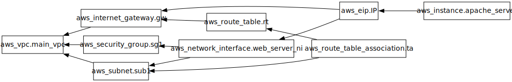

# Terraform AWS EC2 Web Server
This is a simple Terraform project to create an EC2 instance on AWS. The instance will be running a simple apache web server. The project will also create a security group to allow HTTP traffic to the instance.


## Prerequisites
- Terraform installed
- AWS account
- [optional] `secret-tool` Linux tool installed to store AWS credentials under `{aws,secret_key}`, `{aws,secret_key}` pairs.

## Graphz

>generated by dreampuf.github.io

## Usage
1. Clone the repository
2. cd into the repository
3. Run the following command.
    ```bash
    terraform apply $(eval echo $(cat add_secrets | xargs))
    ```
> This part of the command `$(eval echo $(cat add_secrets | xargs))` is used to add the AWS credentials to the command. It resolves to `-var='access_key="$(secret-tool lookup aws access_key)"' -var='secret_key="$(secret-tool lookup aws secret_key)"'` which resolves to `-var=access_key=ABC -var=secret_key=XYZ` where `ABC` and `XYZ` are your AWS access key and secret key respectively. 
4. If you havn't stored your AWS credentials using `secret-tool`, you will be prompted to enter your AWS access key and secret key.
5. After the instance is created, you will see the public IP address of the instance in the output.
    ```bash
    Apply complete! Resources: 9 added, 0 changed, 0 destroyed.

    Outputs:

    public_IP = "52.45.215.117"
    ```
6. Open a browser and navigate to the public IP address of the instance. You should see the default apache web page.
7. To destroy the instance, run the following command.
    ```bash
    terraform destroy $(eval echo $(cat add_secrets | xargs))
    ```

## Notes
- If you want to `ssh` into the instance:
1. create a key pair with the name `main-key` (or whatever you want but change the name in the `main.tf`) using the [aws console](https://us-east-1.console.aws.amazon.com/ec2/home?region=us-east-1#KeyPairs:).
2. Download the key pair `pem` file (for Unix/Linux) and place it in the directory where you would `ssh` from.
3. Run the following command to `ssh` into the instance.
    ```bash
    ssh -i <key_pair.pem> ubuntu@<public_IP>
    ```
    where `<key_pair.pem>` is the name of the key pair file and `<public_IP>` is the public IP address of the instance that you got from the output. `ubuntu` is the the instance name in `main.tf` file. If you changed the name, replace `ubuntu` with the name you used. 